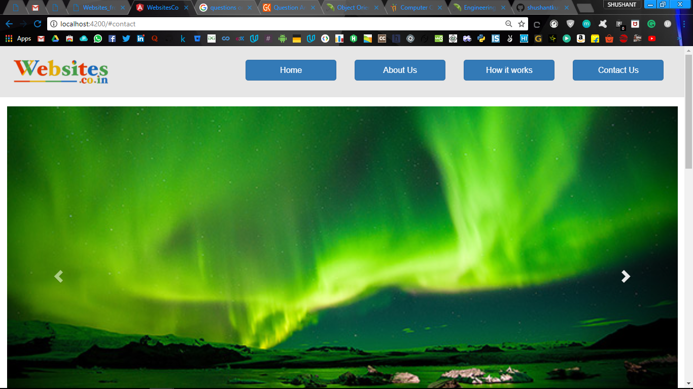

# Websitesco

This project was generated with [Angular CLI](https://github.com/angular/angular-cli) version 1.6.8.<br>
The page is optimised for desktop as well as mobile view.<br>

### Requirements
NodeJs, NPM and angular/cli must be installed <br>  

### Steps

1. Clone the repository


    ```
        git clone https://github.com/shushantkumar/WebsitesCo.git
    ```
2. To install the required dependencies follow below instruction  
    
    ```
        cd WebsitesCo
        npm install
    ```       
   
3. To run frontend Application 

    ```
        ng serve
    ``` 
   and open http://localhost:4200 in your browser to access the Web Application  
<br>

* Desktop View

<br>

* Mobile View


## Development server

Run `ng serve` for a dev server. Navigate to `http://localhost:4200/`. The app will automatically reload if you change any of the source files.

## Code scaffolding

Run `ng generate component component-name` to generate a new component. You can also use `ng generate directive|pipe|service|class|guard|interface|enum|module`.

## Build

Run `ng build` to build the project. The build artifacts will be stored in the `dist/` directory. Use the `-prod` flag for a production build.

## Running unit tests

Run `ng test` to execute the unit tests via [Karma](https://karma-runner.github.io).


## Running end-to-end tests

Run `ng e2e` to execute the end-to-end tests via [Protractor](http://www.protractortest.org/).

## Further help

To get more help on the Angular CLI use `ng help` or go check out the [Angular CLI README](https://github.com/angular/angular-cli/blob/master/README.md).
